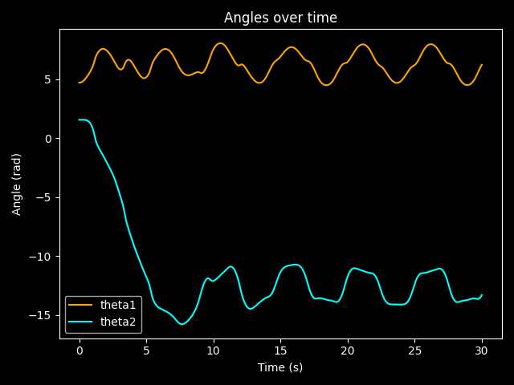
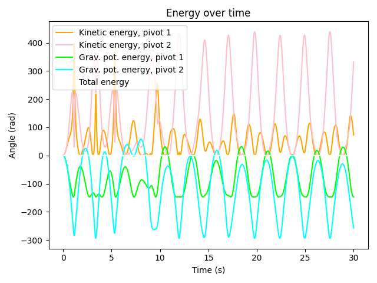
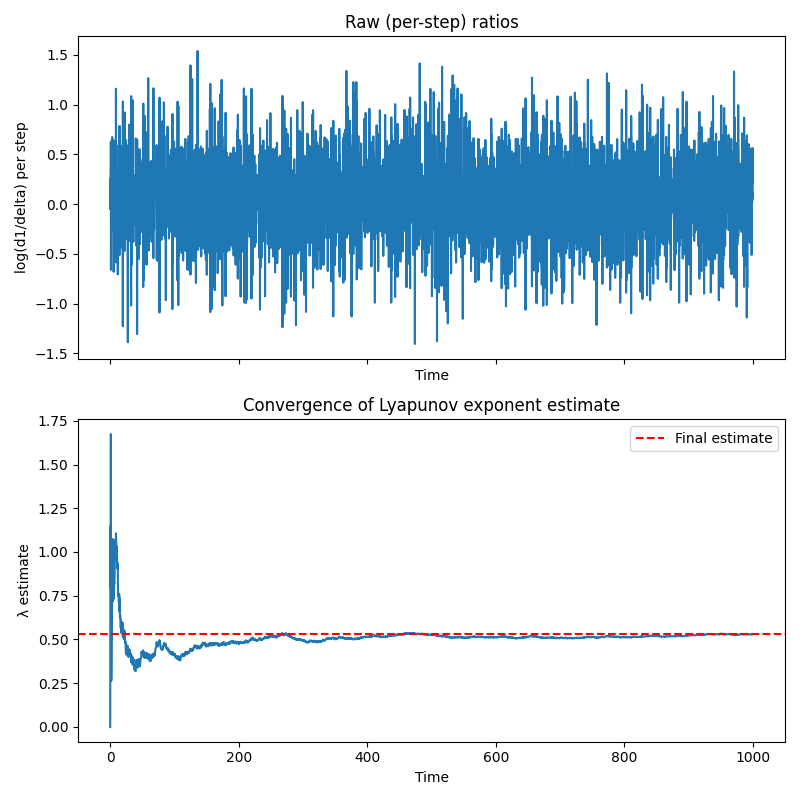
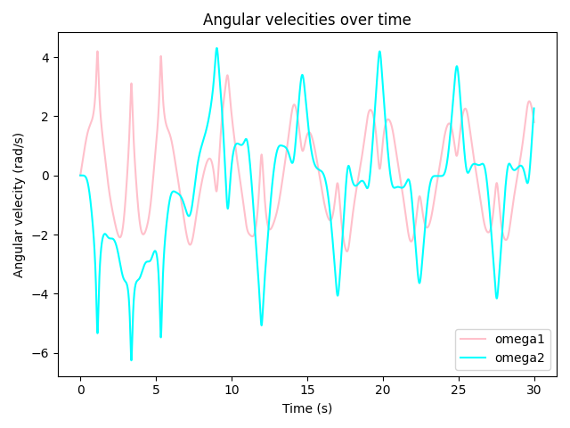
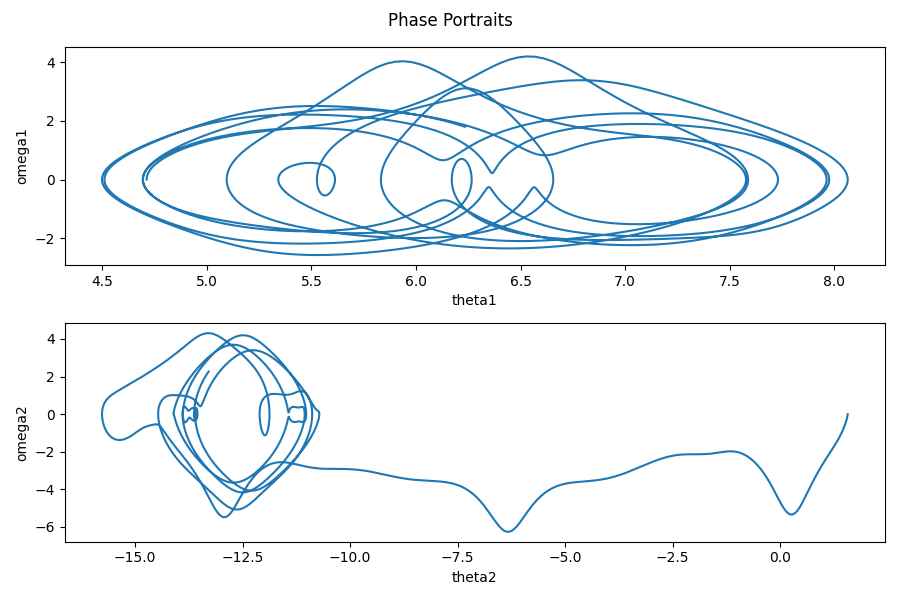
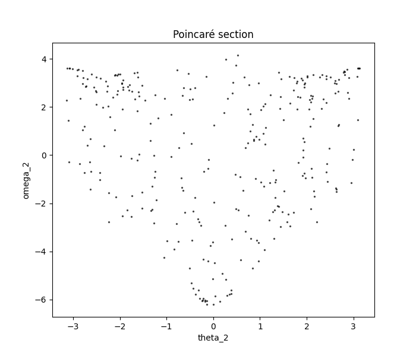
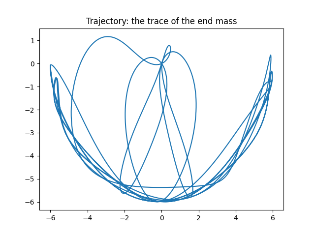

# Double Pendulum Simulator

Short description of what the project does and what makes it interesting.

My project numerically approximates the behaviour of a customisable double pendulum, and uses this solution to create various visualisations. This project interests me as it covers new visualisation techniques, and has expanded my knowledge on integrators in python and file structures and backend systems for GitHub.

## 1: Overview

A double pendulum has a fixed end point at the centre, attached to a  (weightless) rod attached to a mass / pivot, attached to another weightless rod attached to a mass at the end. This is a great example of chaos theory, as a tiny change in the starting conditions creates massive and unpredictable changes in motion. 

My simulation uses 'solve_ivp' to numerically solve the equations, finding approximations for the angle and angular velocities for both pivots. 

## 2: Physics

### 2.1: Equations of Motion

The state vector: 

$$
y= [\theta_1, \omega_1, \theta_2, \omega_2]
$$

contains the angles and angular velocities of the middle and end pivots, respectively.

This vector is obtained by numerically approximating the solution to the two main (differential) equations of motion:

$$
\dot\omega_1 = \frac{-g(2m_1 + m_2)\sin\theta_1 - m_2 g \sin(\theta_1 - 2\theta_2) - 2m_2 \sin(\theta_1 - \theta_2)\left(\omega_2^2 l_2 + \omega_1^2 l_1 \cos(\theta_1 - \theta_2)\right)}{l_1\left(2m_1 + m_2 - m_2\cos(2\theta_1 - 2\theta_2\right)}
$$

&

$$
\dot\omega_2 = \frac{2\sin(\theta_1 - \theta_2)\left(\omega_1^2 l_1 (m_1+m_2) + g(m_1+m_2)\cos\theta_1 + \omega_2^2 l_2 m_2 \cos(\theta_1 - \theta_2)\right)}{l_2\left(2m_1 + m_2 - m_2\cos(2\delta)\right)}
$$

### 2.2: Numerical Method

The ODE solver uses the `RK45` method as it is the standard script methods, due to its automatically-adjusting step size balances speed (useful for visualisation methods that benefit from solutions being 1000s of seconds long) and accuracy (which is crucial for such a sensitive simulation).

Numerical approximations are required, as the cos and sin terms in both equations, depending on both angles and angular velocities, make it impossible to rearrange for a single variable, and hence no analytical solution can exist.

Its worth noting that the solvers' relative and absolute tolerances are both 1e-8, as this also creates a good balance between performance and accuracy

## 3: The Project 

### 3.1: The file structure
```
double_pendulum/
|
|-- pendulums/
|   |-- __init__.py
|   |-- double_pendulum.py
|   |-- physics.py
|   
|-- visualisations/
|   |--__init__.py
|   |--angles.py
|   |-- animate.py
|   |-- energy.py
|   |-- lyapunov.py
|   |-- phase_portrait.py
|   |-- poincare.py
|   |-- trajectory.py
|
|-- examples/
|   |-- chaos.py
|   |-- custom.py
|   |-- order.py
|
|-- figures/
|   |--angles.png
|   |-- animate.gif
|   |-- energy.png
|   |-- lyapunov.png
|   |-- phase_portrait.png
|   |-- poincare.png
|   |-- trajectory.png
|
|-- README.md
|-- pyproject.toml
|-- requirements.txt

```
### 3.2: Details of the main files

pendulums:
  double_pendulum: defines the 'pendulum' object class, and includes the method of solving.
  physics: contains the system of differential equations used in double_pendulum

visualisations:
  angles: plots the angles and / or angular velocities of both pivots over time
  animate: creates an animation of the pendulum
  energy: plots the different energy stores over time
  lyapunov: explores the degree of chaos using Lyapunov exponent estimation
  phase_portrait: plots phase portraits (plots the theta values against the omega values)
  poincare: performs Poincarè analysis to simplify the system (plots the angle and angular velocity of the end mass every time the first bar / pivot points vertically downwards)
  trajectory: plots the path of the end mass

examples:
  chaos: contains an example of a chaotic system
  custom: allows the user to create their own pendulum simulation (see 4.8)
  order: contains an example of an unchaotic system

## 4: Running the simulation for yourself

### 4.4: Requirements
- Python 3.9 or later
- pip

### 4.5: Clone the repository

```bash
git clone https://github.com/ad4mh07/double_pendulum.git
cd double_pendulum
```

### 4.6: Install the package

This installs `pendulums` in editable mode, along with its dependencies (numpy, matplotlib, scipy):

```bash
pip install -e .
```

### 4.7: Run an example

```bash
python3 pendulums/examples/order.py
```

> **Note (macOS/Linux):** if `python` isn't recognised, use `python3` instead.

## 4.8: Using the function
As per 3.2, you can run your own simulation in custom.py, and then call any of the different visulatiuons. It's set up so that all that needs to be done is to determine the arguments / initial conditions. Here's a run down of the arguments taken:
  
  m1 = The mass of the first mass / pivot
  m2 = the mass of the second / end mass
  l1 = the length of the first (weightless) rod
  l2 = the length of the second (weightless) rod
  θ1_init = the initial angle of the first pivot / mass
  θ2_init = the initial angle of the second mass
  time = the time interval to solve over

Finally, lyapunov takes extra arguments:
  (p1: reference pendulum)
  N: number of renormalization steps
  dt: duration of each step in seconds
  delta: initial theta_1 offset


### 5: Limitations / other
- The rods are presumed to have no mass and be rigid (inextensible and inflexible)

- There are no damping forces, ie friction on the pivots, air resistance, etc.

- Some visualtions benefit from different parameters. i.e energy, angles, omegas, phase portraits etc are more clear with a shorter time interval. However, poincare only works (well) with a long interval, such as time=[0,1000].

- lyanpunov works best with a large N value

- To avoid potential bugs, it's best to start the time interval from 0.

## 6: Example outputs
This is an example of the visualisations generated by chaos.py

Animation: \n


Angles over time: \n



Energy stores over time:



Lyapunov exponent estimation:



Angular velocities over time:



Phase portraits]:



Poincarè analysis:



Trajectory (trace of the end mass):



